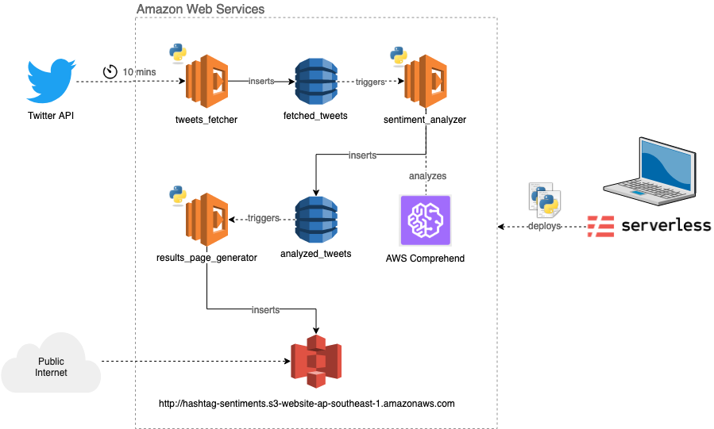

# Hashtag Sentiment Analyzer

[](http://opensource.org/licenses/MIT)
[](https://travis-ci.org/tedmdelacruz/hashtag-sentiment-analyzer)

Analyzes the sentiments of a given hashtag using AWS Comprehend

Working demo http://bit.ly/HashtagSentimentAnalyzer



## Stack


- [AWS Lambda](https://aws.amazon.com/lambda/) for the serverless computing provider
- [AWS Comprehend](https://aws.amazon.com/comprehend/) for retrieving the sentiment analysis
- [Serverless Framework](https://serverless.com) for developing and deploying the serverless application on AWS Lambda

## Setup

```sh
# Install Serverless Framework and its dependencies
npm install

# Deploy the serverless application to AWS Lambda
serverless deploy 

# Shorthand alias
sls deploy

# Removes the deployed stack
sls remove

# Install development dependencies
pip install -t dev_requirements.txt

# Run tests (wip)
nosetests -vs
```

## License

This work is licensed under [The MIT License](https://opensource.org/licenses/MIT).
